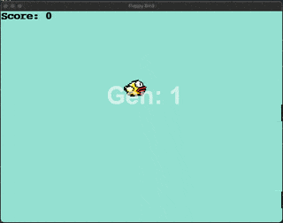

# Self-Playing Flappy Bird 🐤

 
<hr>

## Overview 📌

*Working Progress*

<hr>


## Demo 📸

<p align="center">
  
</p>


## Setup ⚙️

- Ensure you are in the root folder: `ml-flappy-bird/`

### Automated Setup

Run the appropriate script based on your OS

- **Linux/MacOS:**
    ```bash
    ./scripts/demo.sh
    ```

- **Windows:**
    ```bash
    ./scripts/demo.bat
    ```
This script will:
1. Create a virtual environment
2. Install dependencies
3. Run `ml-version.py`
4. Finally, clean up

### Manual

Alternatively, you could create & activate a virtual environment yourself (this would offer more flexibility of course).

- Create Virtual Environment
    ```bash
    python -m venv env
    ```
- Activate Virtual Environment
    ```bash
    source env/bin/activate
    ```
- Upgrade pip within the Virtual Environment
    ```bash
    pip install --upgrade pip
    ```
- Install dependencies
    ```bash
    pip install -r requirements.txt
    ```

- Run ML flappy bird
    ```bash
    python ml-version.py
    ```

- Play the game yourself
    ```bash
    python game.py
    ```

- Deactivate Virtual Environment
    ```bash
    deactivate
    ```
